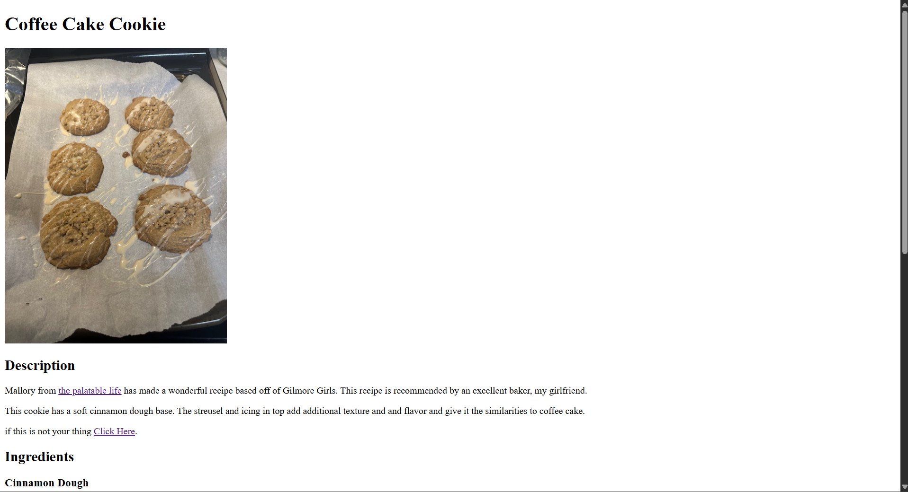

# Recipes

https://jwarren55.github.io/Recipes/

## Description

Recipes is a coding project for Web Development at OKCU. For this project I will share some of my girlfriends favorite recipes. I will also demonstrate my skills of te basics of HTML and making an accessible website.

## Roadmap

1. Make index.html
2. Make Pumpkin Cookie recipe
3. Make Coffee Cake Cookie recipe
4. Make a steak recipe

## Learned

1. Using images on pages.
2. Proper linking pages to navigate the websites. 

## Demo

This image shows the home page of the website. Currently, it is basic with room to expand.

This image shows the top of one of our recipe pages. all pages feature an image of the end product. all pages will also have description of the recipe.

The bottom off every recipe page has ingredients, and the recipe. All pages also have a home button to return to the home page.
